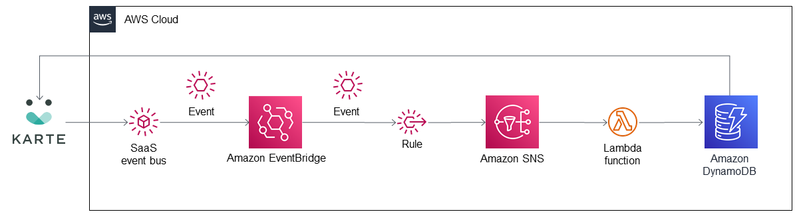

## PLAID KARTE DynamoDB EventBridge integration

This Amazon EventBridge integration combines the PLAID KARTE software as a service (SaaS) with Amazon DynamoDB, Amazon Web Services (AWS) Lambda, and Amazon EventBridge to  store user data in Amazon DynamoDB in real time.

KARTE sends events that contain user data such as ID, recently visited pages, total purchase amount, active campaigns, and other data defined by the KARTE user. You can specify event data as raw code using the KARTE administration window.  

To post feedback, submit feature ideas, or report bugs, use the Issues section of [this GitHub repo](https://github.com/aws-quickstart/eventbridge-integration-solution-karte-dynamodb-integration).

